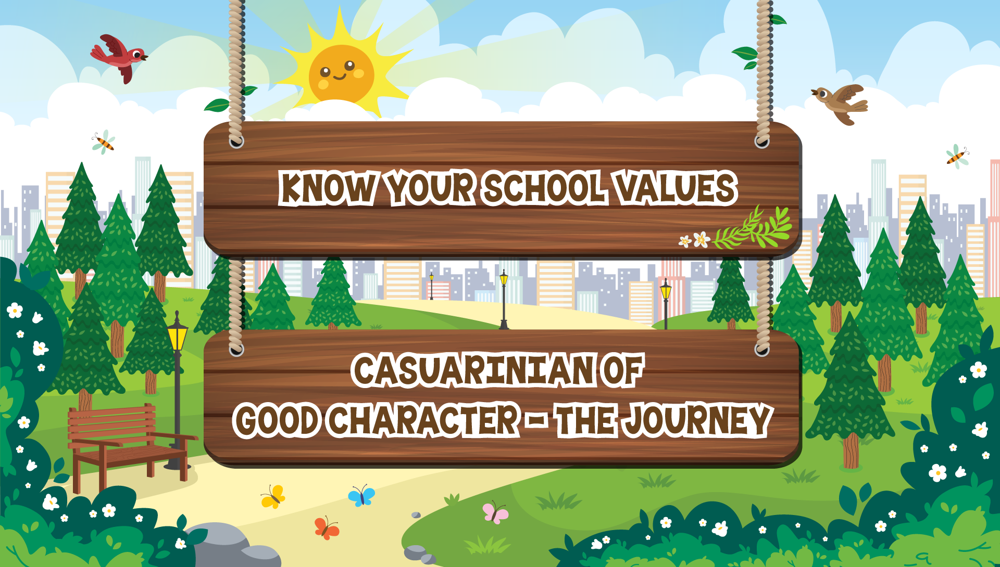

#  Core Values Learning Kiosk

An interactive educational application designed to enhance core values learning for primary school students. Through engaging activities such as quizzes, pair and match, and explore the scene, this app aims to make learning both fun and effective.

- **Project description:** [schoolapp.sg/project/casuarina-primary-school-learning-kiosk/](https://schoolapp.sg/project/casuarina-primary-school-learning-kiosk/)
- **Game Link:** [demo.schoolapp.sg/corevalue/](https://demo.schoolapp.sg/corevalue/)
- **Watch Video:** [YouTube](https://youtu.be/-lf6R91JnYg)
    
 


## 📦 Built With

- HTML5
- CSS3
- JavaScript (Vanilla)
- jQuery
- Progressive Web Application (PWA) for offline access

## 🚀 Getting Started

Clone the repository and open `index.html` in your browser:

```bash
git clone git@github.com:kennykee/interactive-core-values-learning.git

cd interactive-core-values-learning

open index.html   
```
## License

This project is licensed under the MIT License.  
See the [`LICENSE`](./LICENSE) file for full details.
